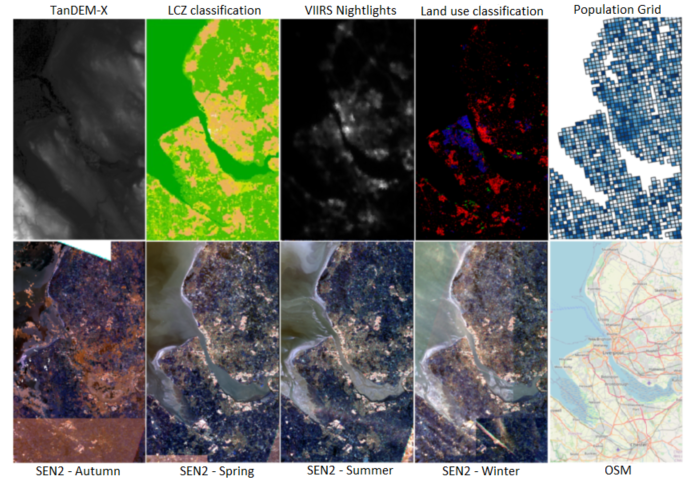

Helmholtz AI CountMeIn Challenge Starter Pack
===================

This starter pack combines all relevant information regarding the CountMeIn Challenge. Below you will find the challenge announcement. Furthermore, here are relevant resources:
- [How to Submit a solution](docs/how_to_submit.md)
- [How we evaluate the submissions](docs/how_we_evaluate.md)
- [Starter Pack Jupyter Notebook](starter-pack.ipynb)
- [A baseline solution based on a random forest](starter-pack.py)
- [Baseline solution description](docs/baseline_solution.md)

In order to create a solution, your code will have to run either on Haicore@KIT (GoGreen and GoFast track) or on Haicore@FZJ (only GoFast). Here you will find the steps necessary to get started on each system.
- [Getting started on HAICORE@KIT](docs/getting_started_haicore_kit.md)
- [Getting started on HAICORE@FZJ](docs/getting_started_haicore_fzj.md)

Our baseline solution can work with the software installed in modules (FZJ only) or with containers based on singularity (FZJ and KIT). For the random forest we have created a singularity container that also contains several libraries required to run the solution. On both machines, you will find the singularity container as `countmein_sklearn_1.0.sif` in the folder where also the data is located. We will also create a container that also features pytorch. 

For convenience, we have added submission script that allow you to easily execute the baseline solution. Unfortunately to the date, we still have technical problems, and the solution is not yet available. 

# Helmholtz AI CountMeIn Challenge (April 11 to May 23, 2022)

Helmholtz AI is proud to announce an exciting data challenge: the Helmholtz AI CountMeIn Challenge. In this challenge, the participant teams will solve a challenging data science problem from the field of remote sensing: A spatially resolved estimate of the population based on satellite images. The task of the challenge is solving the problem up to a target accuracy with the smallest amount of resources possible. In two tracks, two of the most precious resources are addressed. In track GoGreen, the participant contribution wins that used as little energy. For the GoFast track, the task is to use as little time as possible.

This data challenge addresses a scientific audience, and therefore all participants are required to follow Good Scientific Practice. This means that for a valid submission, it is required to make code available, ensure reproducibility and document the steps to solution. The winning contributions to both tracks can present their solutions at the Helmholtz AI Conference.

For both tracks, you will be using the HAICORE installations located at Karlsruhe Institute of Technology (KIT) and Forschungszentrum Jülich (FZJ). The submission will happen on the newly formed [Helmholtz Data Challenges Platform](http://helmholtz-data-challenges.de).

[Get started](https://gitlab.hzdr.de/count-me-in-challenge/orga-team/starter-pack)

[Submit your result](https://gitlab.hzdr.de/count-me-in-challenge/orga-team/starter-pack/-/blob/master/docs/how_to_submit.md)

## Challenge Details
Obtaining a dynamic population distribution is key to many decision-making processes such as urban planning, disaster management and most importantly helping the government to better allocate socio-technical supply. For the aspiration of these objectives, good population data is essential. In a view of this, we provide a comprehensive data set for population estimation in 98 European cities. The data set comprises digital elevation model, local climate zone, land use classifications, nighttime lights in combination with multi-spectral Sentinel-2 imagery, and data from the Open Street Map initiative. 

The final data set consists of two parts, So2Sat POP Part1 and So2Sat POP Part2. All the data patches except OSM data are available as GeoTiff images with the pixel size of 10 m. Along with the raw OSM patches, we also provide the features extracted from the OSM data as the separate Comma Separated Value (CSV) files. So2Sat POP Part1 consists of the patches from local climate zones, land use classification, nighttime lights, Open Street Map and its features, and from all seasons (autumn, summer, spring, winter) of Sentinel-2 imagery (RGB), a total of 1,179,072 files. So2Sat POP Part2 consists of patches from digital elevation model only, a total of 131,008 files. So2Sat POP Part1 has the storage requirement of ~ 38 GB and So2Sat POP Part2 requires ~ 304 MB. Both parts of the data set consists of a predefined train and test split. Out of 98 cities, 78 cities (75% of the data) have been randomly selected as a training set and the rest of the 20 cities (25% of the data) constitute the test set.

To demonstrate the potential capability of our data set, we trained the Random Forest model using the extracted features from the input data to estimate the population on our test data set. The initial results indicate that there is a conceivable potential for the development of powerful machine learning methods with the So2Sat POP data set. With this baseline method, we were able to achieve a prediction with a Root Mean Square Error (RMSE) of 1327.284. It is your task to beat this baseline and achieve a max RMSE of 1111 with as little resources as possible.

For more details regarding the data set, please refer here: http://arxiv.org/abs/2204.08524

## GoGreen
Given the CountMeIn problem and a maximum RMSE of 1111, participants should propose a solution that minimizes the environmental impact (while it achieves the target performance). Participants in this track need to use the HAICORE resources at Karlsruhe Institute of Technology (KIT) as the Computer HoreKa features a very accurate power measurement facilities. The impact will be computed using HAICORE logs, and your submission will include the Job ID.

## GoFast
Given the CountMeIn problem and a RMSE of 1111, participants should propose a solution that minimizes the training and prediction time.  Participants in this track can choose to use the HAICORE resources at  KIT and the HAICORE resources at Forschungszentrum Jülich (FZJ). At KIT, a maximum of 56 A100 GPUs can be used, while at JUWELS Booster at FZJ all 3744 A100 GPUs are available. For the submission, the compute center, as well as the Job ID must be included. 

## Getting Started
To get you on board, we have prepared a repository with a minimum working example. First, you may want to check the [starter-pack](https://gitlab.hzdr.de/count-me-in-challenge/orga-team/starter-pack/). There, you will find all the details, including a Jupyter notebook with an overview of the data, the required preprocessing code, and the baseline solution, a Random Forest for regression. Also, there you will find all the details to prepare a valid submission.

Do you have further questions or would you like to get in touch with us? Please, visit our [Mattermost channel](https://mattermost.hzdr.de/signup_user_complete/?id=f6fhtfz5n3dmje6bt6xjb1btae)!

## Reproducibility and Documentation
As members from the scientific community, we require participants to stick to Good Scientific Practice when submitting a solution. In practice, this requires to fulfill the following requirements

- Your code was run from a clean git repository, and the command to execute the run is included in the logs. 
- The logs contain the commit that is currently checked out and information about the code history 
- With the submission deadline, your code is pushed to a public git repository, where the commit ID of your code and its history are visible. The public repo can contain further commits with documentation, but it must be possible to roll back to the state of your submission.
- The organizing committee must be able to reproduce your time/energy stats within an acceptable accuray.
- If data preprocessing steps are involved, the corresponding preprocessing scripts must be included in the submission commit. Checksums of the processed data files must be added, too.
- The applied method is soundly documented and method attribution suffices in scientific standards.
- Only the provided *train* data can be used to train the model.

Note that you can increase the visibility of your solution by creating a repository in the challenge official repo [https://gitlab.hzdr.de/count-me-in-challenge](https://gitlab.hzdr.de/count-me-in-challenge).

## Prizes
**1st prize**: Attend the Helmholtz AI conference and present your solution; travel (within Europe) and accommodation in Dresden for one team member included, terms & conditions apply.

**2nd prize**: A surprise package.

Each track will be awarded independently.

## Organizers
* Sugandha Doda (German Aerospace Center, DLR)
* Roshni Kamath (Helmholtz AI @ Forschungszentrum Jülich, FZJ)
* René Caspart (Karlsruhe Institute of Technology, KIT)
* Stefan Kesselheim (Helmholtz AI @ Forschungszentrum Jülich, FZJ)
* Andrés Camero (Helmholtz AI @ German Aerospace Center, DLR)

